# Domemaster Photoshop Actions Pack #
**Version 2.2** - Released November 22, 2015  
by Andrew Hazelden 

Email: [andrew@andrewhazelden.com](mailto:andrew@andrewhazelden.com)  
Blog: [http://www.andrewhazelden.com](http://www.andrewhazelden.com)
 

About the Software  
-----------------
The Domemaster Photoshop Actions Pack is a collection of custom Adobe Photoshop actions that were designed to speed up the fulldome content creation workflow. 

The actions provide tools for converting images from several common panoramic formats such as angular fisheye, equirectangular, and cube map panoramas, and general utilities for fulldome production.

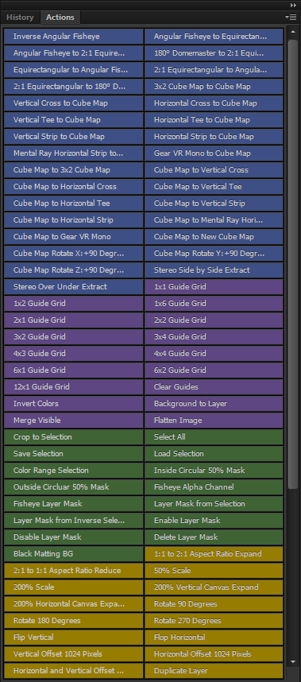

# Version History #

## Version 2.2 - 2015-11-22 ##
- Added a "Cube Map to Gear VR Mono" and "Gear VR Mono to Cube Map" set of actions. The "Cube Map to Gear VR Mono" action creates a 6:1 aspect ratio horizontal strip cubemap and the other action can extract that imagery back into a set of 6 cube map layers.
- Added a "Stereo Side by Side Extract" and a "Stereo Over Under Extract" macro for processing stereo imagery.
- Updated the "Cube Map to X" actions to fix an error that would happen if the File > New... dialog had a transparent background selected, and there was no background layer present in the new document.

## Version 2.1 - 2015-11-21 ##
- Improved the Photoshop compatibility of the "2:1 Equirectangular to 180&deg; Domemaster" action.

## Version 2 - 2015-11-20 ##
- Expanded the **General Utilities** section to include "1x1 Guide Grid", "1x2 Guide Grid", "2x1 Guide Grid", "6x2 Guide Grid", and "12x1 Guide Grid".
- Expanded the **Transforms** section to include "200% Vertical Canvas Expand", and "200% Horizontal Canvas Expand".

# Action List #

## Transforms: ##
  > 1:1 to 2:1 Aspect Ratio Expand  
  > 2:1 to 1:1 Aspect Ratio Reduce  
  > 50% Scale  
  > 200% Scale  
  > 200% Vertical Canvas Expand  
  > 200% Horizontal Canvas Expand  
  > Rotate 90 Degrees  
  > Rotate 180 Degrees  
  > Rotate 270 Degrees  
  > Flip Vertical  
  > Flop Horizontal  
  > Horizontal Offset 1024 pixels   
  > Vertical Offset 1024 pixels  
  > Horizontal and Vertical Offset 1024 pixels  

## Conversions ##
  > Inverse Angular Fisheye  
  > Angular Fisheye to Equirectangular  
  > Angular Fisheye to 2:1 Equirectangular  
  > 180&deg; Domemaster to 2:1 Equirectangular  
  > Equirectangular to Angular Fisheye  
  > 2:1 Equirectangular to Angular Fisheye  
  > 2:1 Equirectangular to 180&deg; Domemaster   
  > 3x2 Cube Map to Cube Map  
  > Gear VR Mono to Cube Map  
  > Vertical Cross to Cube Map  
  > Horizontal Cross to Cube Map  
  > Vertical Tee to Cube Map  
  > Horizontal Tee to Cube Map  
  > Vertical Strip to Cube Map  
  > Horizontal Strip to Cube Map  
  > Cube Map to 3x2 Cube Map  
  > Cube Map to Gear VR Mono  
  > Cube Map to Vertical Cross  
  > Cube Map to Horizontal Cross  
  > Cube Map to Vertical Tee  
  > Cube Map to Horizontal Tee  
  > Cube Map to Vertical Strip  
  > Cube Map to Horizontal Strip  
  > Cube Map to New Cube Map  
  > Cube Map Rotate X:+90 Degrees  
  > Cube Map Rotate Y:+90 Degrees  
  > Cube Map Rotate Z:+90 Degrees  
  > Stereo Side by Side Extract
  > Stereo Over Under Extract
  
## Masking and Selection: ##
  > Crop to Selection  
  > Select All  
  > Save Selection  
  > Load Selection  
  > Color Range Selection  
  > Inside Circular 50% Mask  
  > Outside Circular 50% Mask  
  > Fisheye Alpha Channel  
  > Fisheye Layer Mask  
  > Layer Mask from Selection  
  > Layer Mask from Inverse Selection  
  > Enable Layer Mask  
  > Disable Layer Mask  
  > Delete Layer Mask  
  > Black Matting BG
   
## General Utilities: ##
  > 1x1 Guide Grid  
  > 1x2 Guide Grid  
  > 1x6 Guide Grid  
  > 2x1 Guide Grid  
  > 2x2 Guide Grid  
  > 3x2 Guide Grid  
  > 3x4 Guide Grid  
  > 4x3 Guide Grid  
  > 4x4 Guide Grid  
  > 6x1 Guide Grid  
  > 6x2 Guide Grid  
  > 12x1 Guide Grid  
  > Clear Guides  
  > Invert Colors  
  > Background to Layer  
  > Merge Visible  
  > Flatten Image  
   

# Installation Instructions #

The Domemaster Photoshop Actions Pack is compatible with Photoshop CS3 to CC on both Mac and Windows.

## Step 1. Open the Actions Tab ##

Start by opening Adobe Photoshop. Navigate to the "Window" menu, and select the "Actions" menu item.

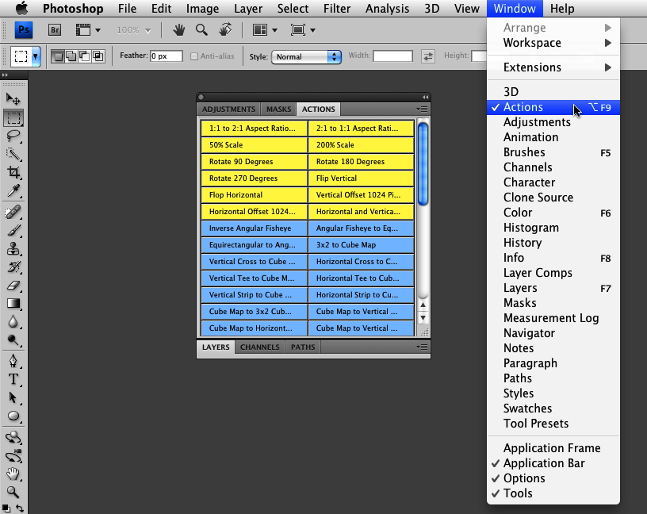

## Step 2. Load the actions. ##

Click on the Actions tab pop-up menu located at the top right of the actions tab.

Select the "Load Actions" menu item.

In the Load dialogue window select the action files "Conversions.atn", "General Utilties.atn", "Masking and Selection.atn", and "Transforms.atn".

Click the Load button to open the action files.

The Domemaster Photoshop Actions Pack files will be loaded into the Actions Tab.

## Step 3. Switch to Button Mode ##

If you want to make it easier to run the actions you can switch the Actions tab to "Button Mode". This will make each action item a clickable button.

Click on the Actions tab pop-up menu located at the top right of the actions tab.

Select the first item in the menu labeled "Button Mode". Your view will switch from a long list into a colorfull grid of labeled buttons.  

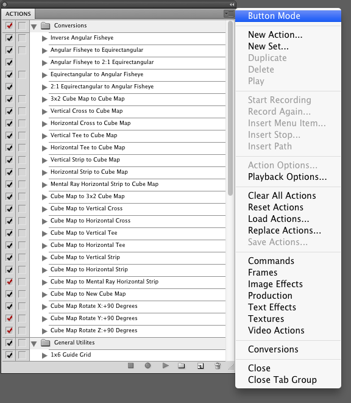

To make it easier to find things, the actions groups are color coded:

The "Conversions" actions are blue. 

The "General Utilities" actions are violet. 

The "Masking and Selection" actions are green.

The "Transforms" actions are yellow.

# Tool Descriptions #

## Transforms ##

### 1:1 to 2:1 Aspect Ratio Expand ###
This action will convert a 1:1 square aspect ratio image into a 2:1 aspect ratio image by scaling the document 200% larger horizontally.

### 2:1 to 1:1 Aspect Ratio Reduce ###
This action will convert a 2:1 square aspect ratio image into a 1:1 aspect ratio image by scaling the document 50% smaller horizontally.

### 50% Scale ###
This action will scale the image 50% smaller using bicubic interpolation.

### 200% Scale ###
This action will scale the image 200% larger using bicubic interpolation.

### 200% Vertical Canvas Expand ###
This action will double the height of the image which is helpful for preparing over under format stereo images. A guide line is added at the edge of the expanded area which makes snapping easier.

### 200% Horizontal Canvas Expand ###
This action will double the width of the image which is helpful for preparing side by side format stereo images. A guide line is added at the edge of the expanded area which makes snapping easier.

### Rotate 90 Degrees ###
This action will rotate the Photoshop document by 90 degrees. This is useful for changing the orientation of the angular fisheye and equirectangular images prior to the conversion.

### Rotate 180 Degrees ###
This action will rotate the Photoshop document by 180 degrees. This is useful for changing the up orientation of the angular fisheye and equirectangular images prior to the conversion.

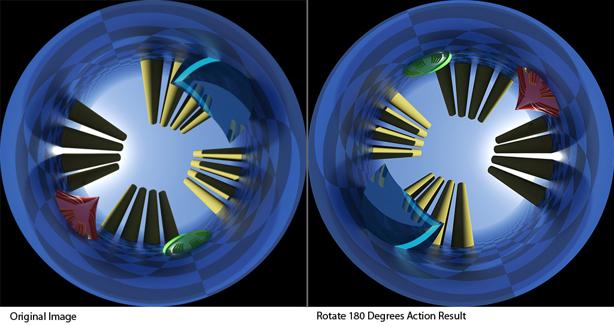

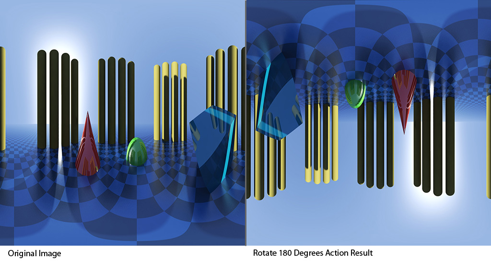

### Rotate 270 Degrees ###
This action will rotate the Photoshop document by 270 degrees. This is useful for changing the up orientation of the angular fisheye and equirectangular images prior to the conversion.

### Flip Vertical ###
This flips the image upside down.

### Flop Horizontal ###
This flops the image left and right.

### Horizontal Offset 1024 Pixels ###
This action slides the image 1024 pixels to the right and wraps the right side of the image around to the left side.

This is useful for changing the content in the center of an equirectangular image. This is also useful for fixing image seams and preparing tiling textures

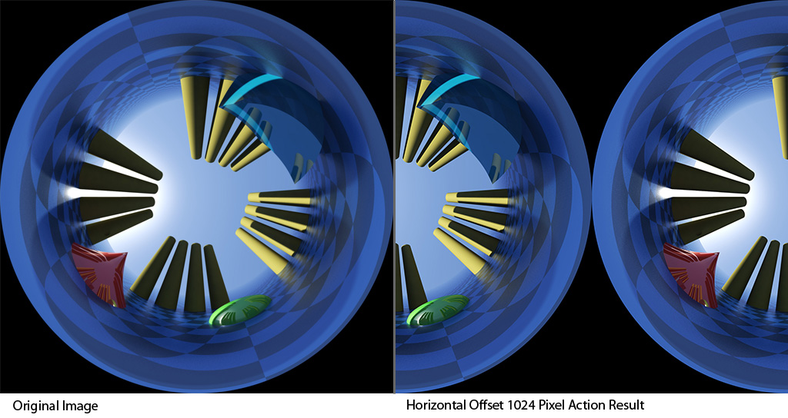

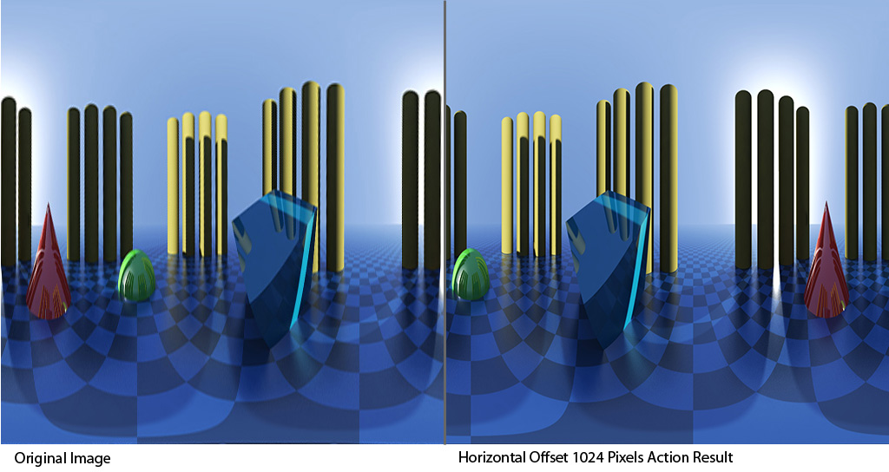

### Vertical Offset 1024 Pixels ###
This action slides the image upwards by 1024 pixels and wraps the top side of the image around to the bottom side. This is useful for fixing image seams and preparing tiling textures.

###Horizontal and Vertical Offset 1024 Pixels
This action slides the image upwards and to the right by 1024 pixels and wraps the top and right side of the image around to the bottom side. This is useful for fixing image seams and preparing tiling textures. 

If you are running this action on a 2K square resolution image it will shift the seams on an image's border to the center of the document. After you have finished your cloning or touch-up work you can run the action a 2nd time so the image border will be reset to its original position. 

On a 4K square or 8K square resolution image you will need to run the action multiple time until the seam is shifted into the center of the document.

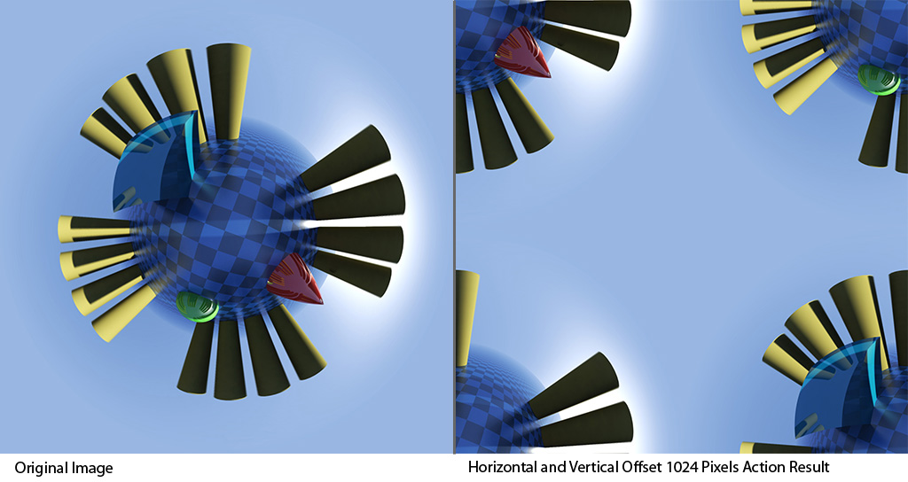

## Conversions ##

### Inverse Angular Fisheye ###
This action will allow you to inverse an angular fisheye image. This is the effect "rolling" the inside of the fisheye image to the outside of the frame. This effect works best with a 360&deg; degree fisheye image.

The action can be used to quickly turn a regular angular fisheye image into a "tiny planet" style image.

The inverted fisheye effect is achieved by taking your angular fisheye image and doing a polar to rectangular conversion. Then the action rotates the image 180 degrees. The final step is to convert the image from rectangular coordinates back into polar coordinates.

The latest version of Photoshop CC (14.2.1+) has added support for 16-bit per channel and 32-bit per channel imagery in the Polar Coordinates filter. If you are using an older version of Photoshop, the action will not work on 16-bit per channel and 32-bit per channel images due to limitations in Photoshop's "Polar to Rectangular" image filter.

*Note:* It is also possible to use the "Inverse Angular Fisheye" action a 2nd time to convert a "tiny planet" image back into a normal fisheye image.

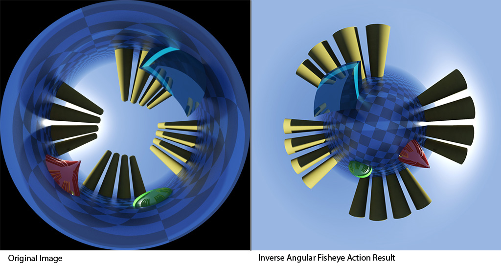

### Angular Fisheye to Equirectangular ###
This action converts a full frame fisheye image into a 360&deg; x 180&deg; spherical panorama with a ratio of 1:1. This means a fulldome image with a 2048x2048 resolution will be converted to a 2048x2048 resolution lat/long image. This is done with the help of the Photoshop polar to rectangular coordinates filter.

This action can also be used on individual alpha channels by selecting the alpha channel in the Channels tab and then clicking the button for the action.

The latest version of Photoshop CC (14.2.1+) has added support for 16-bit per channel and 32-bit per channel imagery in the Polar Coordinates filter. If you are using an older version of Photoshop, the action will not work on 16-bit per channel and 32-bit per channel images due to limitations in Photoshop's "Polar to Rectangular" image filter.

Tip: If you see a visible seam artifact at the 0&deg; mark after converting to/from an angular fisheye format you can try flattening the image before performing the conversions. 

### Angular Fisheye to 2:1 Equirectangular ###
This action converts a full frame fisheye image into a 360&deg; x 180&deg; spherical panorama with a ratio of 2:1. This means a fulldome image with a 2048x2048 resolution will be converted to a 4096x2048 resolution lat/long image. This is done with the help of the Photoshop polar to rectangular coordinates filter.

This action can also be used on individual alpha channels by selecting the alpha channel in the Channels tab and then clicking the button for the action.

The latest version of Photoshop CC (14.2.1+) has added support for 16-bit per channel and 32-bit per channel imagery in the Polar Coordinates filter. If you are using an older version of Photoshop, the action will not work on 16-bit per channel and 32-bit per channel images due to limitations in Photoshop's "Polar to Rectangular" image filter.

Tip: If you see a visible seam artifact at the 0&deg; mark after converting to/from an angular fisheye format you can try flattening the image before performing the conversions. 

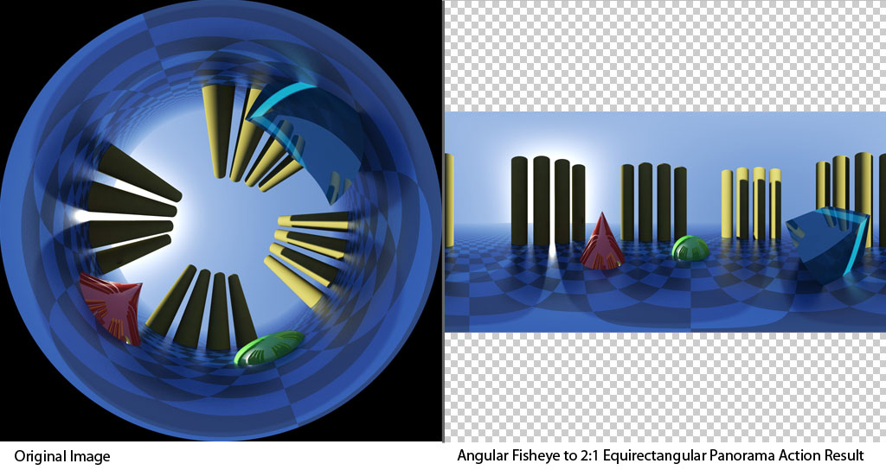

### 180&deg; Domemaster to 2:1 Equirectangular ###
This action converts a 180&deg; Domemaster angular fisheye image into a 360&deg; x 180&deg; spherical panorama with a ratio of 2:1. 

Since a domemaster frame only has a vertical coverage area of 90 degrees when converted into a spherical format, this image will have the bottom / empty half of the spherical frame filled with a black background color.

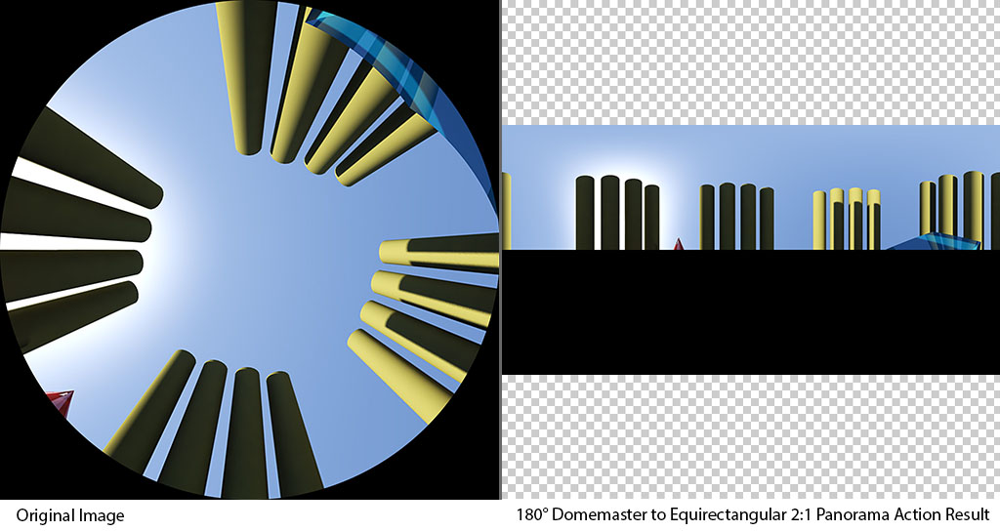

### Equirectangular to Angular Fisheye ###
This action converts a 360&deg; x 180&deg; spherical panorama into a full frame fisheye image. This means a lat/long image with a 1:1 aspect ratio like 2048x2048 pixels will be converted to a 2048x2048 angular fisheye image. This is done with the help of the Photoshop rectangular to polar coordinates filter.

This action can also be used on individual alpha channels by selecting the alpha channel in the Channels tab and then clicking the button for the action.

The latest version of Photoshop CC (14.2.1+) has added support for 16-bit per channel and 32-bit per channel imagery in the Polar Coordinates filter. If you are using an older version of Photoshop, the action will not work on 16-bit per channel and 32-bit per channel images due to limitations in Photoshop's "Polar to Rectangular" image filter.

Tip: If you see a visible seam artifact at the 0&deg; mark after converting to/from an angular fisheye format you can try flattening the image before performing the conversions. 

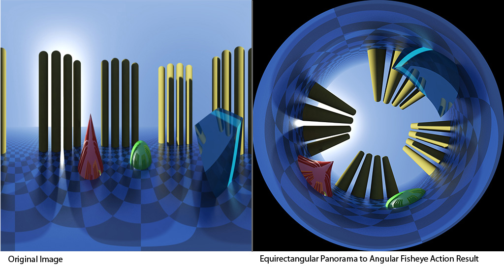

### 2:1 Equirectangular to Angular Fisheye ###
This action converts a 360&deg; x 180&deg; spherical panorama into a full frame fisheye image. This means a lat/long image with a 2:1 aspect ratio like 4096x2048 pixels will be converted to a 2048x2048 angular fisheye image. This is done with the help of the Photoshop rectangular to polar coordinates filter.

This action can also be used on individual alpha channels by selecting the alpha channel in the Channels tab and then clicking the button for the action.

The latest version of Photoshop CC (14.2.1+) has added support for 16-bit per channel and 32-bit per channel imagery in the Polar Coordinates filter. If you are using an older version of Photoshop, the action will not work on 16-bit per channel and 32-bit per channel images due to limitations in Photoshop's "Polar to Rectangular" image filter.

Tip: If you see a visible seam artifact at the 0&deg; mark after converting to/from an angular fisheye format you can try flattening the image before performing the conversions. 

### 2:1 Equirectangular to 180&deg; Domemaster ###
This action converts a 360&deg; x 180&deg; spherical panorama into a 180&deg; domemaster  formatted angular fisheye image. This means a lat/long image with a 2:1 aspect ratio will be converted to a domemaster formatted image with a black circular fisheye mask applied around the frame. 

This is done with the help of the Photoshop rectangular to polar coordinates filter.

### 3x2 Cube Map to Cube Map ###
This converts a 3x2 cube map format image into the cubic layer map panorama format.

The converted cubic map faces are named:

<table>
  <tr>
    <td>front</td>
  </tr>
  <tr>
    <td>right</td>
  </tr>
  <tr>
    <td>back</td>
  </tr>
  <tr>
    <td>left</td>
  </tr>
  <tr>
    <td>top</td>
  </tr>
  <tr>
    <td>bottom</td>
  </tr>
</table>

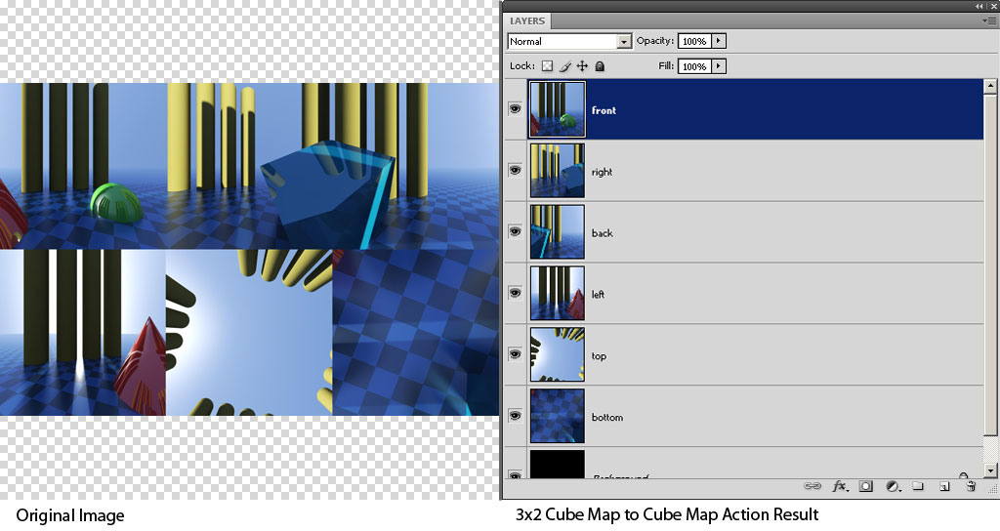

### Gear VR Mono to Cube Map ###
This converts a Gear VR / Octange Render monoscopic horizontal strip format panorama into the cubic map panorama format.

The input image is expected to be in a aspect 6:1 ratio. If the input image is 6,144x1024 pixel image the output will be a 1024x1024 pixel layered photoshop image.

The converted cubic map faces are named:

<table>
  <tr>
    <td>front</td>
  </tr>
  <tr>
    <td>right</td>
  </tr>
  <tr>
    <td>back</td>
  </tr>
  <tr>
    <td>left</td>
  </tr>
  <tr>
    <td>top</td>
  </tr>
  <tr>
    <td>bottom</td>
  </tr>
</table>

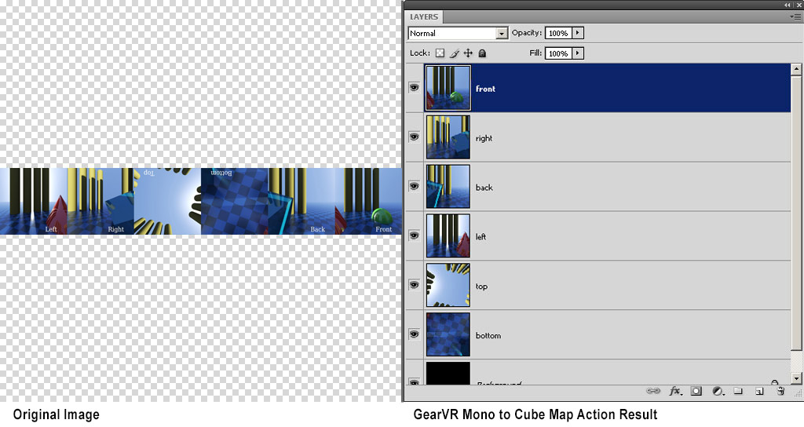

### Vertical Cross to Cube Map ###
This converts a vertical cross format panorama into the cubic map panorama format.

The converted cubic map faces are named:

<table>
  <tr>
    <td>front</td>
  </tr>
  <tr>
    <td>right</td>
  </tr>
  <tr>
    <td>back</td>
  </tr>
  <tr>
    <td>left</td>
  </tr>
  <tr>
    <td>top</td>
  </tr>
  <tr>
    <td>bottom</td>
  </tr>
</table>

### Horizontal Cross to Cube Map ###
This converts a horizontal cross format panorama into the cubic map panorama format.

The converted cubic map faces are named:

<table>
  <tr>
    <td>front</td>
  </tr>
  <tr>
    <td>right</td>
  </tr>
  <tr>
    <td>back</td>
  </tr>
  <tr>
    <td>left</td>
  </tr>
  <tr>
    <td>top</td>
  </tr>
  <tr>
    <td>bottom</td>
  </tr>
</table>

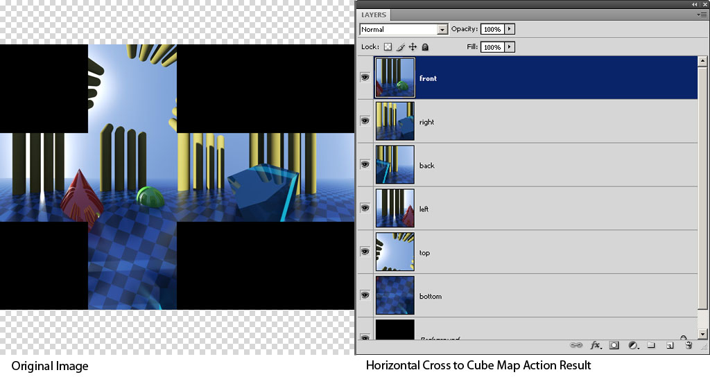

### Vertical Tee to Cube Map ###
This converts a vertical tee format panorama into the cubic map panorama format.

The converted cubic map faces are named:

<table>
  <tr>
    <td>front</td>
  </tr>
  <tr>
    <td>right</td>
  </tr>
  <tr>
    <td>back</td>
  </tr>
  <tr>
    <td>left</td>
  </tr>
  <tr>
    <td>top</td>
  </tr>
  <tr>
    <td>bottom</td>
  </tr>
</table>

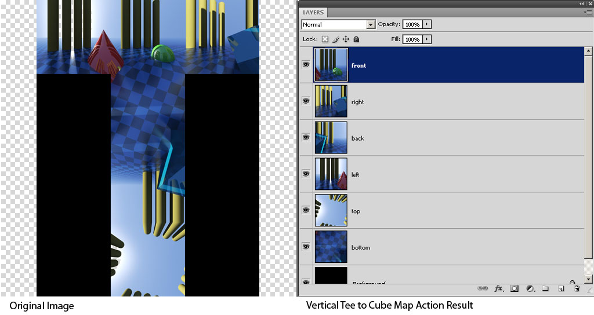

### Horizontal Tee to Cube Map ###
This converts a horizontal tee format panorama into the cubic map panorama format.

The converted cubic map faces are named:

<table>
  <tr>
    <td>front</td>
  </tr>
  <tr>
    <td>right</td>
  </tr>
  <tr>
    <td>back</td>
  </tr>
  <tr>
    <td>left</td>
  </tr>
  <tr>
    <td>top</td>
  </tr>
  <tr>
    <td>bottom</td>
  </tr>
</table>

### Vertical Strip to Cube Map ###
This converts a vertical strip format panorama into the cubic map panorama format.

The input image is expected to be in a aspect 1:6 ratio. If the input image is 1024x6,144 pixel image the output will be a 1024x1024 pixel layered photoshop image.

The converted cubic map faces are named:

<table>
  <tr>
    <td>front</td>
  </tr>
  <tr>
    <td>right</td>
  </tr>
  <tr>
    <td>back</td>
  </tr>
  <tr>
    <td>left</td>
  </tr>
  <tr>
    <td>top</td>
  </tr>
  <tr>
    <td>bottom</td>
  </tr>
</table>

### Horizontal Strip to Cube Map ###
This converts a horizontal strip format panorama into the cubic map panorama format.

The input image is expected to be in a aspect 6:1 ratio. If the input image is 6,144x1024 pixel image the output will be a 1024x1024 pixel layered photoshop image.

The converted cubic map faces are named:

<table>
  <tr>
    <td>front</td>
  </tr>
  <tr>
    <td>right</td>
  </tr>
  <tr>
    <td>back</td>
  </tr>
  <tr>
    <td>left</td>
  </tr>
  <tr>
    <td>top</td>
  </tr>
  <tr>
    <td>bottom</td>
  </tr>
</table>

### Mental Ray Horizontal Strip to Cube Map ###
This converts a mental ray `mib_lookup_cube1` horizontal strip format panorama into the cubic map panorama format.

The input image is expected to be in a aspect 6:1 ratio in the mental ray cubic frame layout. If the input image is 6,144x1024 pixel image the output will be a 1024x1024 pixel layered photoshop image.

The input image is in the mental ray `mib_lookup_cube1` horizontal strip image format:

<table>
  <tr>
    <td>left</td>
  </tr>
  <tr>
    <td>right</td>
  </tr>
  <tr>
    <td>bottom</td>
  </tr>
  <tr>
    <td>top (flipped vertically)</td>
  </tr>
  <tr>
    <td>back</td>
  </tr>
  <tr>
    <td>front</td>
  </tr>
</table>

The output from this action is a layered Photoshop document with cubic faces named:

<table>
  <tr>
    <td>front</td>
  </tr>
  <tr>
    <td>right</td>
  </tr>
  <tr>
    <td>back</td>
  </tr>
  <tr>
    <td>left</td>
  </tr>
  <tr>
    <td>top</td>
  </tr>
  <tr>
    <td>bottom</td>
  </tr>
</table>

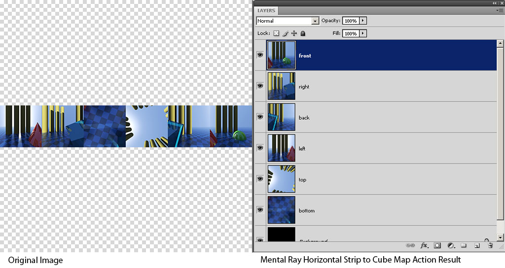

### Cube Map to 3x2 Cube Map ###

This converts a cube map format image into the 3x2 panorama format.

### Cube Map to Vertical Cross ###
This converts a cube map format image into the vertical cross panorama format.

The converted vertical cross faces are located in the format:

<table>
  <tr>
    <td>blank</td> <td>top</td> <td>blank</td>
  </tr>
  <tr>
    <td>left</td> <td>front</td> <td>right</td>
  </tr>
  <tr>
    <td>blank</td> <td>bottom</td> <td>blank</td>
  </tr>
  <tr>
    <td>blank</td> <td>back (rotated 180&deg;)</td> <td>blank</td>
  </tr>
</table>

### Cube Map to Gear VR Mono ###

This converts a cube map format image into the Gear VR / Octane Render ORBX 6:1 aspect ratio horizontal strip cubic panorama format.

The converted horizontal strip faces are located in the format:

<table>
  <tr>
    <td>Left</td> <td>Right</td> <td>Top (rotated 180)</td> <td>Bottom (rotated 180)</td> <td>Back</td>  <td>Front</td> 
  </tr>
</table>

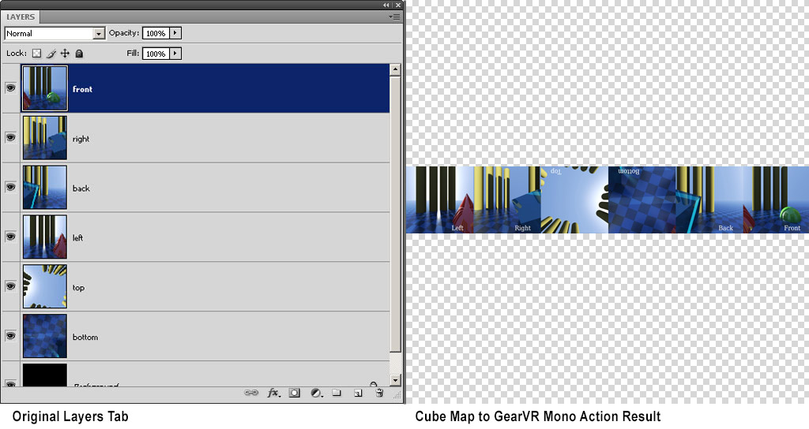

### Cube Map to Horizontal Cross ###
This converts a cube map format image into the horizontal cross panorama format.

The converted horizontal cross faces are located in the format:

<table>
  <tr>
    <td>blank</td> <td>top</td> <td>blank</td> <td>blank</td>
  </tr>
  <tr>
    <td>left</td> <td>front</td> <td>right</td> <td>back</td>
  </tr>
  <tr>
    <td>blank</td> <td>bottom</td> <td>blank</td> <td>blank</td>
  </tr>
</table>

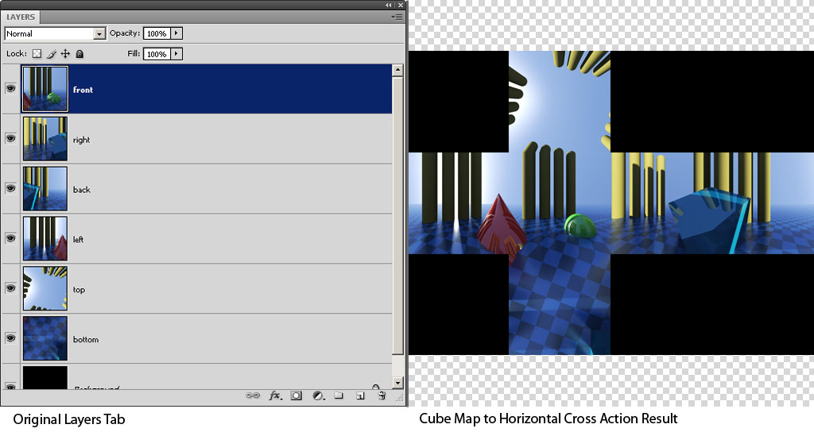

### Cube Map to Vertical Tee ###
This converts a cube map format image into the vertical tee panorama format.

The converted vertical tee faces are located in the format:

<table>
  <tr>
    <td>left</td> <td>front</td> <td>right</td>
  </tr>
  <tr>
     <td>blank</td> <td>bottom</td><td>blank</td>
  </tr>
  <tr>
     <td>blank</td> <td>back (rotated 180&deg;)</td> <td>blank</td> 
  </tr>
  <tr>
     <td>blank</td> <td>top</td> <td>blank</td>
  </tr>
</table>

### Cube Map to Horizontal Tee ###
This converts a cube map format image into the horizontal tee panorama format.

The converted horizontal tee faces are located in the format:

<table>
  <tr>
    <td>blank</td> <td>top</td> <td>blank</td> <td>blank</td>
  </tr>
  <tr>
    <td>front</td> <td>right</td> <td>back</td> <td>left</td>
  </tr>
  <tr>
    <td>blank</td> <td>bottom</td> <td>blank</td> <td>blank</td>
  </tr>
</table>

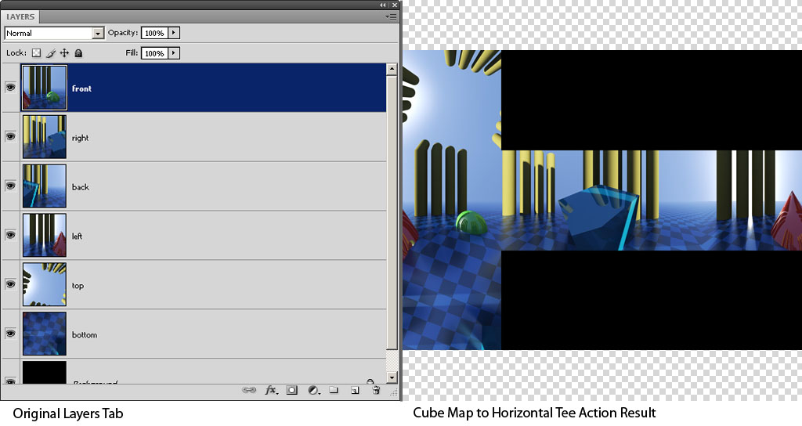

### Cube Map to Vertical Strip ###
This converts a cube map format image into a single column panorama format.

The vertical strip faces are located in the format:

<table>
  <tr>
    <td>front</td>
  </tr>
  <tr>
    <td>right</td>
  </tr>
  <tr>
    <td>back</td>
  </tr>
  <tr>
    <td>left</td>
  </tr>
  <tr>
    <td>top</td>
  </tr>
  <tr>
    <td>bottom</td>
  </tr>
</table>

### Cube Map to Horizontal Strip ###
This converts a cube map format image into a single row panorama format.

The horizontal strip faces are located in the format:

<table>
  <tr>
    <td>front</td> <td>right</td> <td>back</td> <td>left</td> <td>top</td> <td>bottom</td>
  </tr>
</table>

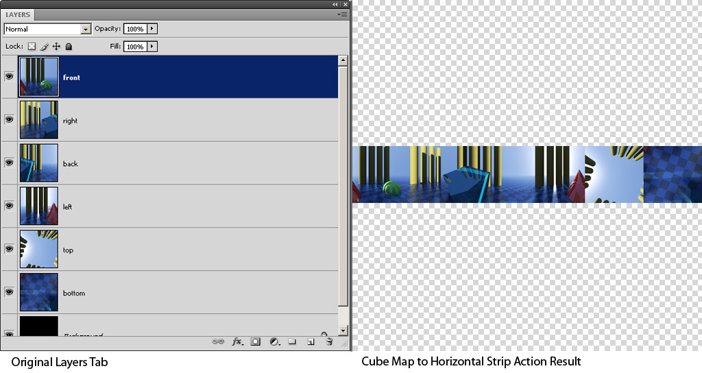

### Cube Map to Mental Ray Horizontal Strip ###
This converts a cube map format image into a single row panorama format.

This converts a layered cubic map Photoshop document into a mental ray `mib_lookup_cube1` horizontal strip format panorama.

The input image is expected to be in a 1:1 aspect ratio. If the input image is a layered 1024x1024 pixel image the output will be a 6,144x1024 pixel image with a 6:1 aspect ratio.

The input for this action is a layered Photoshop document with cubic faces named:

<table>
  <tr>
    <td>front</td>
  </tr>
  <tr>
    <td>right</td>
  </tr>
  <tr>
    <td>back</td>
  </tr>
  <tr>
    <td>left</td>
  </tr>
  <tr>
    <td>top</td>
  </tr>
  <tr>
    <td>bottom</td>
  </tr>
</table>

The output image is in the mental ray `mib_lookup_cube1` horizontal strip image layout with the following cubic map face order:

<table>
  <tr>
    <td>left</td>
  </tr>
  <tr>
    <td>right</td>
  </tr>
  <tr>
    <td>bottom</td>
  </tr>
  <tr>
    <td>top (flipped vertically)</td>
  </tr>
  <tr>
    <td>back</td>
  </tr>
  <tr>
    <td>front</td>
  </tr>
</table>

### Cube Map to New Cube Map ###

This action will copy the cube map "front", "right", "back", "left", "top", and "bottom" layers from your current Photoshop document into a new Photoshop document.

### Cube Map Rotate X:+90 Degrees ###

This action will rotate the cube map panorama by 90 degrees on the X-axis. This has the effect of turning the front "view" upwards towards the sky.

Tip: If you want to rotate a cross style, tee style, 3x2 cubic map, or strip style pano you need to convert them to the layered "cube map" format first using the actions in the Conversions Actions tab group.

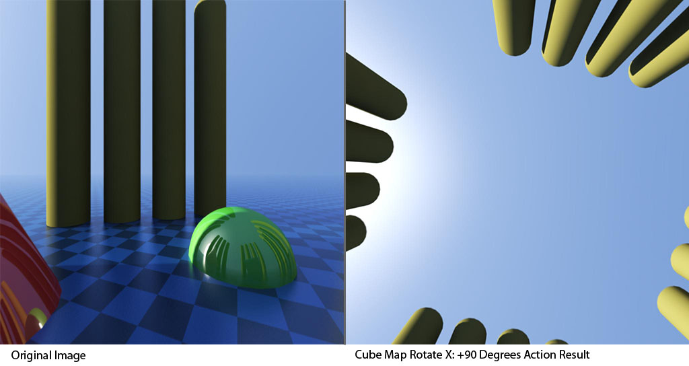

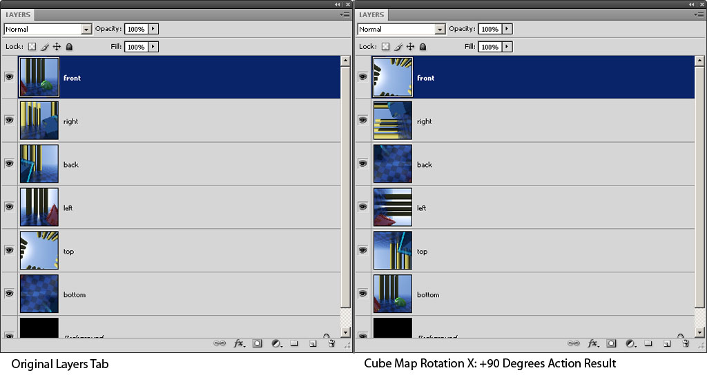

### Cube Map Rotate Y:+90 Degrees ###

This action will rotate the cube map panorama by 90 degrees on the Y-axis. The has the effect of turning the front "view" towards the left.

Tip: If you want to rotate a cross style, tee style, 3x2 cubic map, or strip style pano you need to convert them to the layered "cube map" format first using the actions in the Conversions Actions tab group.

### Cube Map Rotate Z:+90 Degrees ###

This action will rotate the cube map panorama by 90 degrees on the Z-axis. This has the effect of rotating the front "view" 90 degrees clockwise to the right. 

Tip: If you want to rotate a cross style, tee style, 3x2 cubic map, or strip style pano you need to convert them to the layered "cube map" format first using the actions in the Conversions Actions tab group.

### Stereo Side by Side Extract ###

This action will copy the left and right stereo views out of a side by side stereo format image.

A new image will be created and then two layers will be added with the layer names of "left" and "right".

The source image should have the stereo image layout of:

<table>
  <tr>
    <td>left</td> <td>right</td>
  </tr>
</table>

### Stereo Over Under Extract ###

This action will copy the left and right stereo views out of an over under stereo format image.

A new image will be created and then two layers will be added with the layer names of "left" and "right".

The source image should have the stereo image layout of:

<table>
  <tr>
    <td>left</td>
  </tr>
  <tr>
    <td>right</td>
  </tr>
</table>

## Masking and Selection ##

### Crop to Selection ###
This action will crop the Photoshop document smaller based upon the currently selected area. The crop command will reduce the image size based upon a square cropping rectangle drawn around the current selection shape.

### Select All ###
This action will select all of the pixels on the current image layer.

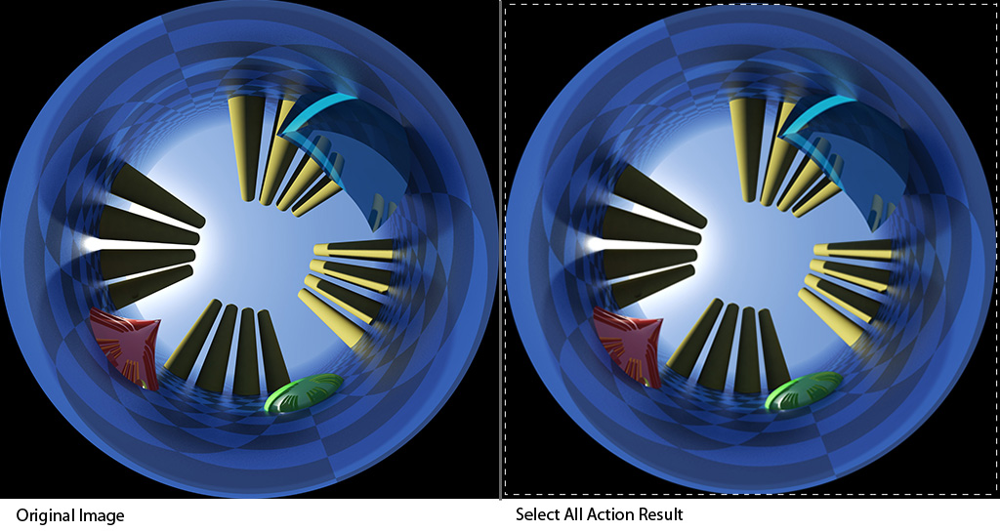

### Save Selection ###
This action will save the current selection to a new alpha channel.

### Load Selection ###
This action will open the "Load Selection" dialogue. You can choose to load either a layer mask, transparency channel, or an alpha channel into the current selection region.

There are several advanced options in the the "Load Selection" dialogue that will let you do differencing operations ( new, add, subtract, intersect, or invert) your current selection.

For example of you were painting a layer mask you could change your current selection region by subtracting the shape of a mask or alpha channel from another layer or image.

### Color Range Selection ###
This action will load the "Color Range" dialogue. This dialogue is useful for using a color / luma keying approach to generate a new selection region.

You can preview the effects of the selection region in the dialogue or use the "Selection Preview" pop-up menu to view the results in the main Photoshop  window.

### Inside Circular 50% Mask ###
This action creates a circular layer mask that hides the area inside a circular region in the center of the current layer.

### Outside Circular 50% Mask ###
This action creates a circular layer mask that hides the area outside a circular region in the center of the current layer.

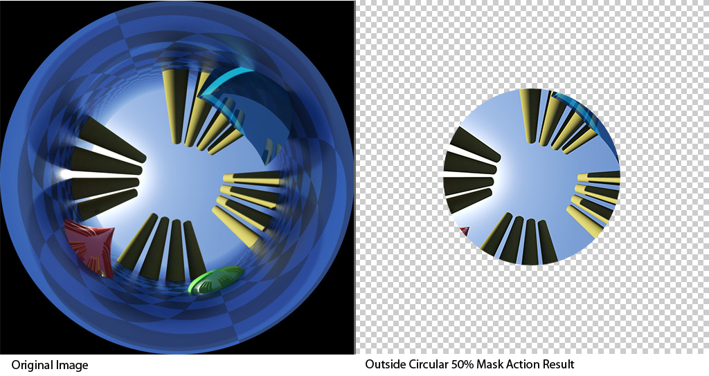

### Fisheye Alpha Channel ###
This action creates a full frame circular alpha channel.

A common use is to create a single circular alpha channel and then use the "load selection" action to repetitively make circular domemaster shaped boundary selections.

### Fisheye Layer Mask ###
This action creates a full frame circular layer mask on the currently select layer.

To use this action you must convert all flattened background layers into floating layers. You can do this using the "Background to Layer" action.

### Layer Mask From Selection ###
This action applies a new raster layer mask based upon the current selection. To use this action you must remove any existing "raster" layer masks from the current layer.

Layer masks are a quick and easy way to temporarily hide content on an image layer. 

After you create a new layer mask you can edit the layer mask by opening the layers tab and clicking on the mask icon to the right of the layer icon. When the layer mask is selected you can paint the mask using the brush tool.

#### Layer Mask Editing Tips ####
When editing a layer mask you can paint regions of the layer visible or invisible by changing the brush color to either white or black.

You can create transparent areas on the layer by using a shade of gray as the brush color when painting the layer mask.
 
If you adjust the brush hardness to 100% you can paint a crisp hard-edged matte. For a nice soft matte edge set the brush hardness to a value between 0 to 80%.

You can view the contents of a single layer mask full-screen by holding down the option key on Mac OS X or the alt key on Windows, and clicking on a layer mask thumbnail image in the Layers Tab. 

To exit the full-screen layer mask view you need to click back on the layer's color thumbnail image in the Layers Tab.

You can invert a layer mask by selecting the layer mask thumbnail icon and clicking the "Invert Colors" action button. This will reverse the visible and hidden areas in the layer mask.

### Layer Mask From Inverse Selection ###
This action creates a new layer mask based upon inverting the current selection. To use this action you must remove any existing "raster" layer masks from the current layer.

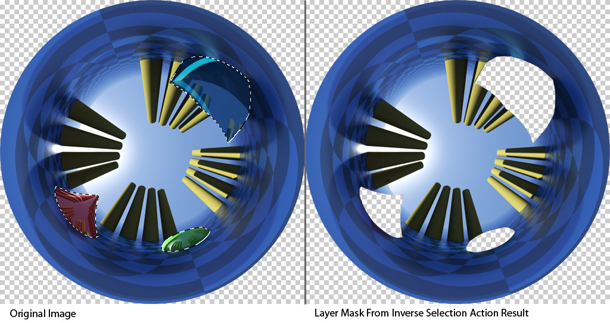

### Enable Layer Mask ###
This action will enable the layer mask on the current layer. This is useful for comparing the effects of transparency on the current layer.

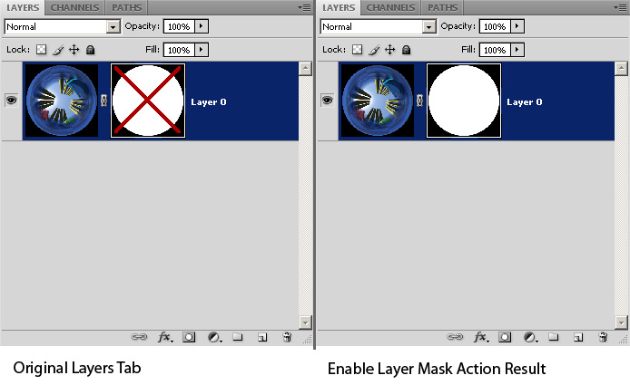

### Disable Layer Mask ###
This action temporarily disables the layer mask on the current layer. This is useful for comparing the effects of transparency on the current layer.

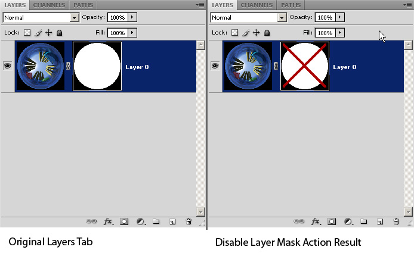

### Delete Layer Mask ###
This action deletes the layer mask on the current layer.

### Black Matting BG ###
This action creates a new shape layer with a black background color. 

If the current image layer is a floating layer, the black BG shape layer will be placed behind it. If the current image layer is a flattened background layer, the Black BG shape layer will be placed on top of it.

## General Utilities ##

### 1x1 Guide Grid ###
This creates a guide layout that forms a basic outline of the image frame. This grid is extremely useful for making accurate selections in the image when the "Snap to Guides" command is turned on.

### 1x2 Guide Grid ###
This creates an over under stereo format guide grid. This grid is extremely useful for making accurate selections in the image when the "Snap to Guides" command is turned on.

### 1x6 Guide Grid ###
This creates a vertical strip style 1x6 alignment guide layout. This grid is extremely useful for making accurate selections in the image when the "Snap to Guides" command is turned on.

### 2x1 Guide Grid ###
This creates a side by side stereo format guide grid. This grid is extremely useful for making accurate selections in the image when the "Snap to Guides" command is turned on.

### 2x2 Guide Grid ###
This creates a 2x2 guide grid that divides the image into quarters. This grid is extremely useful for making accurate selections in the image when the "Snap to Guides" command is turned on.

### 3x2 Guide Grid  ###
This creates a 3x2 cube map style alignment guide layout. This grid is extremely useful for making accurate selections in the image when the "Snap to Guides" command is turned on.

### 3x4 Guide Grid ###
This creates a vertical cross or vertical tee style 3x4 alignment guide layout. This grid is extremely useful for making accurate selections in the image when the "Snap to Guides" command is turned on.

### 4x3 Guide Grid ###
This creates a horizontal cross or horizontal tee style 4x3 alignment guide layout. This grid is extremely useful for making accurate selections in the image when the "Snap to Guides" command is turned on.

### 4x4 Grid Guide ###
This action creates a 4x4 style alignment guide layout. This grid is extremely useful for making accurate selections in the image when the "Snap to Guides" command is turned on. You can use the grid to make sure the nadir point in the fulldome image is perfect centered.

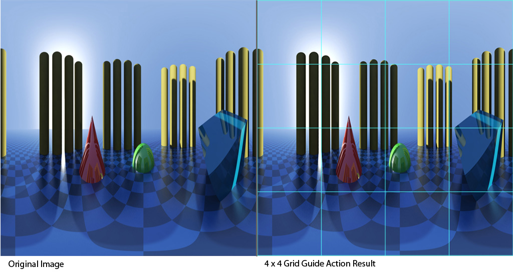

### 6x1 Guide Grid ###
This creates a horizontal strip style 6x1 alignment guide layout. This grid is extremely useful for making accurate selections in the image when the "Snap to Guides" command is turned on.

### 6x2 Guide Grid ###
This creates a 2 image high, over under stereo format, horizontal strip style 6x1 alignment guide layout. This grid is extremely useful for making accurate selections in the image when the "Snap to Guides" command is turned on.

### 12x1 Guide Grid ###
This creates a side by side stereo format horizontal strip style 6x1 alignment guide layout. This grid is extremely useful for making accurate selections in the image when the "Snap to Guides" command is turned on.

### Clear Guides ###
This action will remove all of the guides from the current Photoshop document.

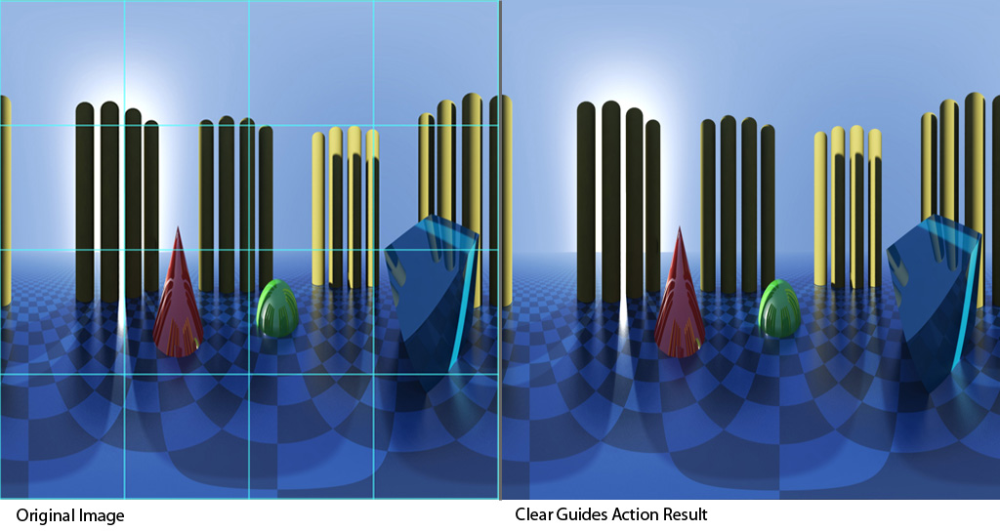

### Invert Colors ###
This action will invert the image colors of the currently selected layer. This action can be used on color images, layer masks, and alpha channels.

My favorite use of this filter is to invert a grayscale layer mask. This will reverse the visible and hidden parts of the layer mask. 

This action can be used on individual alpha channels by selecting the alpha channel in the Channels tab and then clicking the button for the action. The action can also used on a layer mask by selecting the layer mask's thumbnail icon in the layers tab and then clicking the button for the action.

### Background to Layer ###
This action will convert a flattened image from the background layer mode into a floating layer that supports features like layer masks.

The most common use for this action is to prepare an imported picture like a flat JPEG .jpg or Targa .tga file for custom layer masks.

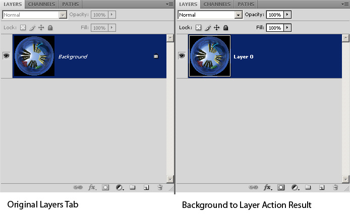

### Merge Visible ###
This action will merge all of the visible layers into a single layer. 

This action is different than the flatten image command in that it will ignore any hidden layers. You can use the merge visible command to selectively flatten layers by hiding the other layers, elements, and groups you want to keep.

This version of Merge Visible can merge a single layer and bake the layer mask and layer style effects into the final image.

### Flatten Image ###
This action will merge all of the layers in the current Photoshop document. This is useful for removing transparency from an image, merging layer style effects, vector shapes, and editable text layers into a single raster image.

When an image is flattened, all of the transparent background areas in the image will be filled with a solid color.

*Note:* You really want to have saved a backup of your Photoshop document before you flatten the image because all of your layers are permanently merged into a single element!

* * *

Actions created by Andrew Hazelden. (c) copyright 2015.